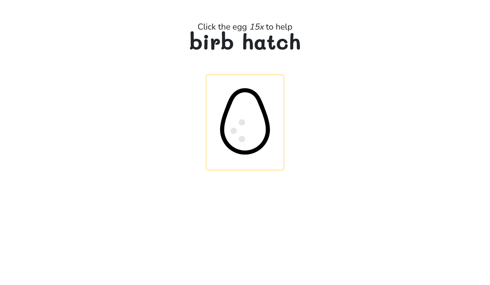
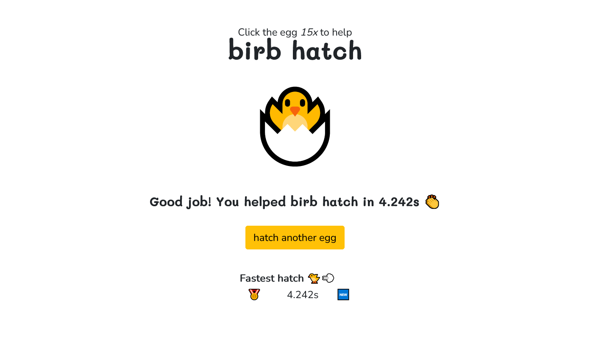
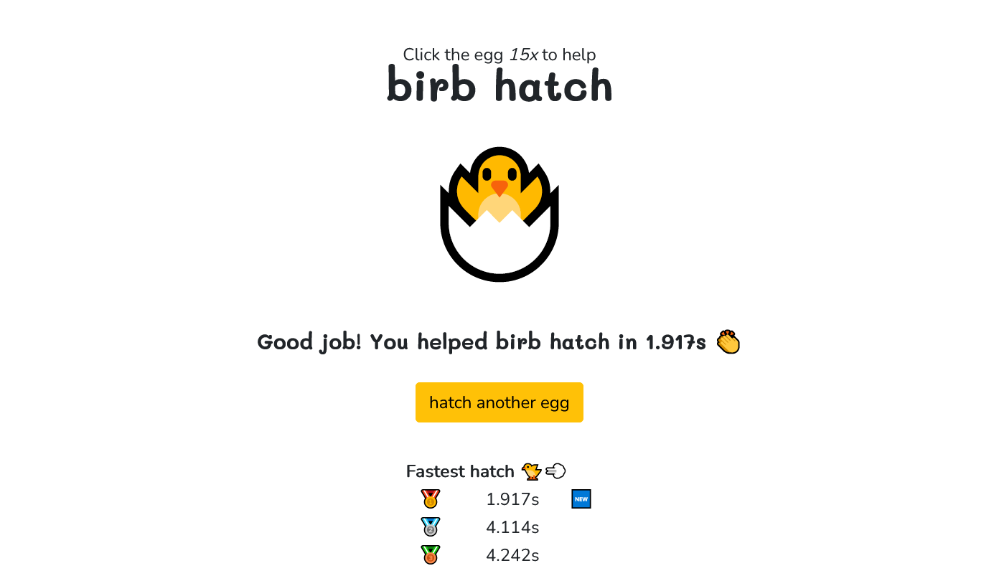

# Birb Hatch

A simple game where you click the egg button 🥚 to help the bird ("birb") hatch 🐣, created with React.

## Demo

Working live demo: https://leeqv.github.io/birb-hatch/

## Features

Hatch the egg 🥚 as fast as you can 🐣.

Hatch eggs as many times as you want. Beat your old best records 🥇🐤💨.

## Technologies used

- React 18.2.0
- Zustand 4.4.1
- Bootstrap 5.1.3
- Sass 1.66.1

### Dev tools
- Prettier 3.0.2
- Eslint 8.47.0
- Stylelint 15.10.3